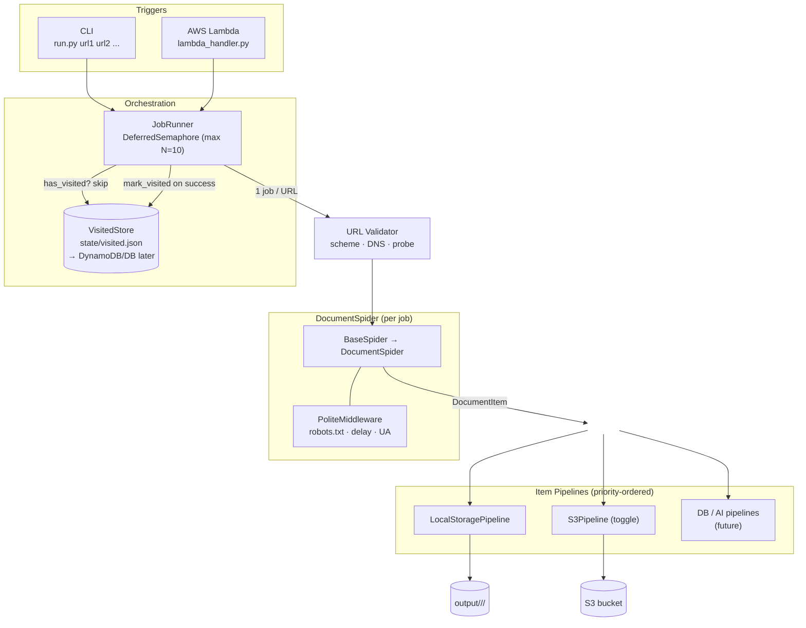

# webscraper

A modular, ethical web scraper built on [Scrapy](https://scrapy.org/).  
Currently supports downloading PDF and Word documents from one or more URLs.  
Designed so new scraper types, storage backends, and AI pipelines can be added with minimal friction.

**Key features**

- **Per-URL jobs** — each URL runs as its own spider/job; up to *N* (default 10) run concurrently.
- **Visited store** — a persistent registry skips already-scraped sites and guards against loops.
- **Pluggable storage** — local filesystem now, S3 toggleable, database/AI pipelines drop in later.
- **Ethical by default** — honours `robots.txt`, throttled requests, identifiable user-agent.

---

## Architecture



**Flow:** a trigger (CLI or Lambda) hands a list of URLs to the `JobRunner`, which launches one spider job per URL — at most *N* concurrently — skipping any URL already in the `VisitedStore`. Each job validates its URL, crawls politely, emits `DocumentItem`s through the pipeline chain (local + optional S3, with DB/AI slots reserved), and the URL is recorded as visited on success.

---

## Quick start

```bash
# 1. Create and activate a virtual environment
python -m venv .venv
.venv\Scripts\activate          # Windows
# source .venv/bin/activate     # macOS / Linux

# 2. Install dependencies
pip install -r requirements.txt

# 3. Copy and fill in the environment file
copy .env.example .env          # Windows
# cp .env.example .env          # macOS / Linux

# 4. Run a single URL
python run.py https://example.com/docs

# ...or several at once (each becomes its own job, capped at --max-jobs)
python run.py https://a.com https://b.com https://c.com --max-jobs 3

# ...or from a file (one URL per line)
python run.py --urls-file urls.txt
```

Output files land in `output/<hostname>/<job_id>/`.  
A timestamped log is written to `logs/<batch_id>.log`.  
Scraped URLs are recorded in `state/visited.json` and skipped on re-runs (use `--force` to override).

---

## CLI options

```
python run.py [urls ...] [--urls-file FILE] [--max-jobs N] [--force] [--log-level LEVEL] [--no-ping]
```

| Flag | Default | Description |
|---|---|---|
| `urls` | — | One or more seed URLs (space-separated) |
| `--urls-file` | — | File with one URL per line (`#` comments allowed) |
| `--max-jobs` | `10` | Max concurrent jobs (one job per URL) |
| `--force` | off | Re-scrape URLs even if already in the visited store |
| `--log-level` | `INFO` | Verbosity |
| `--no-ping` | off | Skip reachability probe before crawling |

---

## Environment variables (`.env`)

| Variable | Default | Description |
|---|---|---|
| `LOCAL_ENABLED` | `true` | Save files to `output/` |
| `S3_ENABLED` | `false` | Upload files to S3 |
| `S3_BUCKET` | — | S3 bucket name |
| `AWS_ACCESS_KEY_ID` | — | AWS credentials |
| `AWS_SECRET_ACCESS_KEY` | — | AWS credentials |
| `AWS_DEFAULT_REGION` | `eu-central-1` | AWS region |
| `DOWNLOAD_DELAY` | `1` | Seconds between requests (ethical scraping) |
| `CONCURRENT_REQUESTS` | `4` | Parallel requests *within* one crawl |
| `MAX_CONCURRENT_JOBS` | `10` | Max URL jobs running concurrently |
| `VISITED_STORE_PATH` | `state/visited.json` | Persistent scraped-URL registry |
| `LOG_LEVEL` | `INFO` | Logging verbosity |

---

## Project structure

```
webscraper/
├── run.py                          CLI entrypoint
├── lambda_handler.py               AWS Lambda stub
├── scrapy.cfg
├── requirements.txt
├── .env.example
│
├── webscraper/
│   ├── settings.py                 Feature flags, pipeline toggles, rate-limit config
│   ├── items.py                    DocumentItem definition
│   │
│   ├── validators/
│   │   └── url_validator.py        Scheme / DNS / reachability checks
│   │
│   ├── jobs/
│   │   └── job_runner.py           Concurrency-capped multi-URL job runner
│   │
│   ├── state/
│   │   └── visited_store.py        Persistent scraped-URL registry (dedup/loop guard)
│   │
│   ├── spiders/
│   │   ├── base_spider.py          Abstract base — all spiders inherit this
│   │   └── document_spider.py      Scrapes PDF / DOCX links from a seed URL
│   │
│   ├── pipelines/
│   │   ├── base_pipeline.py        Interface every pipeline must implement
│   │   ├── local_storage_pipeline.py
│   │   └── s3_pipeline.py
│   │
│   ├── middlewares/
│   │   └── polite_middleware.py    robots.txt, delay, user-agent enforcement
│   │
│   └── utils/
│       └── logging_config.py       File + console logging setup
│
├── logs/                           One .log file per batch run
├── state/                          Persistent visited-URL registry (visited.json)
└── output/                         Downloaded files (local storage)
```

---

## Adding a new spider

1. Create `webscraper/spiders/my_spider.py`.
2. Subclass `BaseSpider`.
3. Set a unique `name = "my_spider"`.
4. Implement `parse()`.
5. Done — Scrapy auto-discovers it. Invoke with `process.crawl(MySpider, ...)`.

## Adding a new pipeline

1. Create `webscraper/pipelines/my_pipeline.py`.
2. Subclass `BasePipeline`.
3. Implement `process_item()`.
4. Register it in `webscraper/settings.py` under `ITEM_PIPELINES` with a priority number.

## Concurrency & deduplication

- **Per-URL jobs:** `JobRunner` launches one `DocumentSpider` per URL and caps simultaneous jobs at `--max-jobs` (default 10) via a Twisted `DeferredSemaphore`. Locally this is N concurrent spiders in one process; in production the same semantics map to N concurrent Lambda invocations (one job per URL).
- **Within a crawl:** Scrapy's built-in `RFPDupeFilter` prevents fetching the same request twice.
- **Across runs:** the `VisitedStore` (`state/visited.json`) records every successfully scraped URL. Re-running skips them unless `--force` is passed. Swap `JsonVisitedStore` for a DynamoDB/SQL implementation by subclassing `BaseVisitedStore` — no other code changes needed.

---

## AWS Lambda deployment

See `lambda_handler.py` for the full deployment checklist and expected event payload.

```json
{
  "url": "https://example.com/resources",
  "job_id": "optional-custom-id",
  "log_level": "INFO"
}
```
